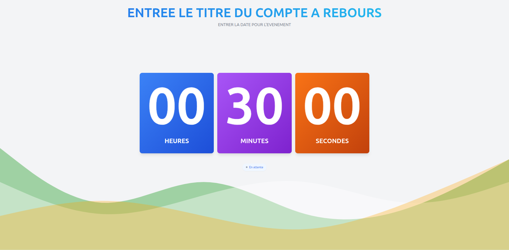
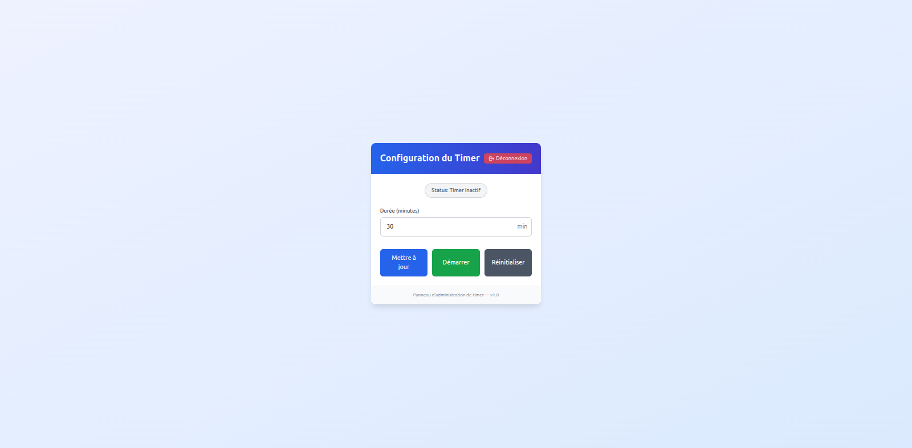

# Application de Compte à Rebours




## Description
Application interactive de compte à rebours avec :
- Interface publique avec effets visuels dynamiques
- Panel d'administration sécurisé
- Synchronisation en temps réel via WebSockets

## Fonctionnalités principales
- Affichage dynamique du compte à rebours (heures, minutes, secondes)
- Effets visuels évolutifs selon le temps restant
- Changement dramatique d'affichage pour les 60 dernières secondes
- Interface d'administration pour :
  - Configurer la durée initiale
  - Démarrer/arrêter le compte à rebours
  - Réinitialiser le timer

## Installation

### Prérequis
- Node.js (version 16 ou supérieure)
- npm

### Backend
```bash
cd backend
npm install
npm start
```

### Frontend
```bash
npm install
npm run dev
```

## Utilisation

### Mode Public
Accédez à l'application via :
```
http://localhost:5173
```

### Mode Admin
Accédez au panel d'administration via :
```
http://localhost:5173/admin/login
```
Mot de passe par défaut : `` (configurable dans `backend/server.js`)

## Structure Technique

### Frontend
- React + Vite
- TailwindCSS pour le styling
- Socket.IO client pour la communication temps réel

### Backend
- Node.js + Express
- Socket.IO server
- SQLite pour le stockage des paramètres

## Captures d'écran
L'application propose deux modes d'affichage :
1. **Vue normale** : Affichage complet des heures, minutes et secondes
2. **Dernières secondes** : Mode plein écran pour les 60 dernières secondes

## Configuration
Les paramètres modifiables incluent :
- Durée initiale du compte à rebours (dans l'interface admin)
- Mot de passe admin (dans `backend/server.js`)
- Styles CSS (dans `src/App.css` et `src/Countdown.jsx`)
